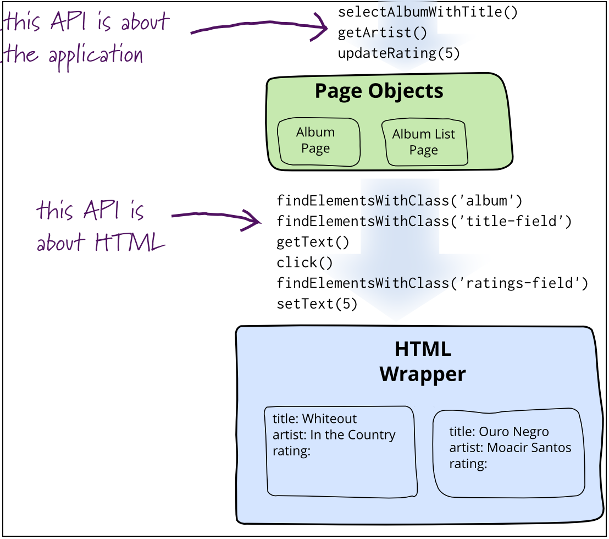

# Brekout Session 3

`npm run serve -w ui5-js-app`

## Page Objects

Separate in reuseable parts, pages/ views and eg. header, footer etc. similar like the application under test. Compare different approaches and show advantages.

This is not new ->

- Martin Fowler 2013
- wdio
- OPA5

wdi5 is about gluing together.

WebdriverIO was designed with Page Object Pattern support in mind and so is wdi5. There are no additional packages required to create page objects. By introducing the "elements as first class citizens" principle, it is now possible to build up large test suites using this pattern.

Martin Fowler 2013: [https://martinfowler.com/bliki/PageObject.html](Page Objects)
[https://webdriver.io/docs/pageobjects/](wdio Page Objects)

The goal of using page objects is to abstract any page information away from the actual tests. Ideally, you should store all selectors or specific instructions that are unique for a certain page in a page object, so that you still can run your test after you've completely redesigned your page.

`npm run wdi5 -w ui5-js-app -- --spec pageObjects.test.js`

- standard style (no assertions in page object)
- bdd (beahvior driven development) style like opa5 and uiveri5 [OPA5 Page Objects](https://openui5.netweaver.ondemand.com/topic/f2f843d375384d56bbf955a80ee66ab6)
  - iDoSomething
  - iCheckSomething
- wdio style
- Reuse of selectors (header, footer, fragments etc.) reused in different page objects

## Browserstack

Runs basic test against online available test app

- open: [https://automate.browserstack.com/dashboard/v2/builds/65365392642cbe8306ebca663993b7e286a3c0ac/sessions/b05fe5b8599f74a9aff8f84ba1db6a4ce1195397](browserstack)
- run `npm run wdi5-bs -w ui5-js-app -- --spec basic.test.js`.

Also possible to run the application under test on your local machine.
